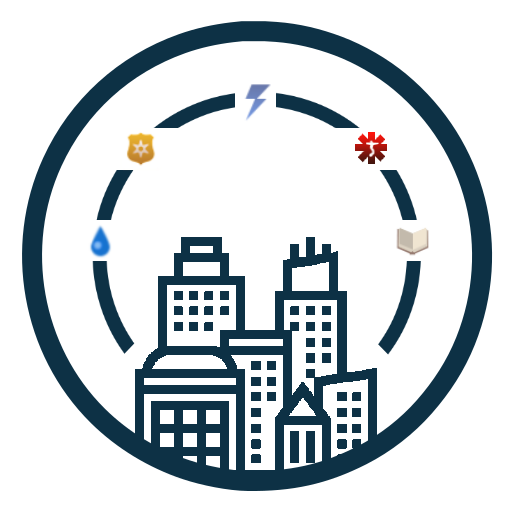

# CSL-SimpleMetrics

  

Lightweight metrics bar mod for Cities: Skylines. It adds a compact, draggable overlay that shows service capacity vs. usage with color-coded indicators on the in-game UI.

  

Additionally, it might be a great CSL modding entry point as I tried to build it with clean code standards.

This is my first game modding project from scratch. I hope you find it useful.

## Steam Workshop

Coming soon.

## Development Notes

- Load hook: `Extensions/LoadingExtension.cs`
- Manager component: `Behaviours/Manager.cs`
- UI: `UI/Window.cs`
- Metrics calculation: `Services/MetricsService.cs`

## Build

Modding CSL requires `.NET Framework 3.5` and references the Cities: Skylines managed assemblies directly from a local install.

The project has an automated post-build event that copies the latest build to the Cities: Skylines mods directory.

`%LOCALAPPDATA%\Colossal Order\Cities_Skylines\Addons\Mods\$(SolutionName)`

More information about building the mod is available [here](https://skylines.paradoxwikis.com/Advanced_Mod_Setup).

Check [credits](#credits) for documentation references and other cool modders which codebases gave me a lot of information.

## Credits and kudos

Other modders whose codebases were helpful while building this mod:

- keallu's [CSL-WatchIt](https://github.com/keallu/CSL-WatchIt) mod
- rob-williams [CityVitalsWatchMod](https://github.com/rob-williams/CityVitalsWatchMod)

Thanks for your great work and for indirectly helping this project!

Documentation references and other sources:

- Cities: Skylines in-game sprite and API references
  - [Paradox's developer guide](https://skylines.paradoxwikis.com/Developer_guides) → it ain't much but it's honest work!
  - [Modding basics](https://skylines.paradoxwikis.com/Modding_Basics) → if you want to mod CSL, start from here
  - [CSL resources](https://citiesskylinesmoddingguide.readthedocs.io/en/latest/resources/index.html) → base for all icons in the mod
- Icons and visual assets: https://www.flaticon.com
